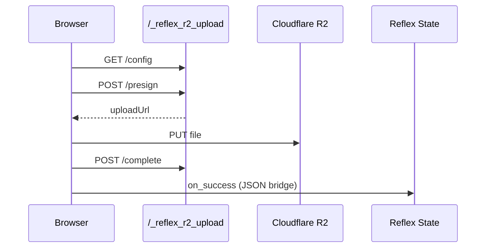

# Architecture & implementation

**Language:** [中文](../zh/architecture.md) · [English](../en/README.md)

| [Docs home](../en/README.md) | [Configuration](configuration.md) | [Bridge](bridge-payload.md) | [Private bucket](private-bucket.md) | **Architecture** |

---

## Overview

`reflex_r2_upload` adds browser-direct uploads to Cloudflare R2 for [Reflex](https://reflex.dev) apps:

1. **`upload_zone`** — upload UI (styled or headless via `.root`)  
2. **`wrap_app(app)`** — inject JS runtime + mount reserved Starlette routes  
3. **Bridge** — hidden `<input>` passes JSON to `on_success`  
4. **R2** — presigned PUT from the browser; Python only signs URLs  

## Layers

```
Reflex app (State.on_uploaded)
        ↓
reflex_r2_upload
  wrap.py / provider.py   — integration
  upload_zone.py          — UI + browser script
  routes.py               — /_reflex_r2_upload/*
  storage.py / keys.py    — R2 + object keys
  config.py               — env vars or R2Config
        ↓
Reflex frontend (:3000)  +  Starlette backend (:8000)  +  Cloudflare R2
```

## Upload flow



1. **Presign** — allocate `storagePath`, return presigned PUT URL  
2. **PUT** — browser uploads directly to R2 (needs bucket CORS)  
3. **Complete** — validate `keyPrefix` / `storagePath`, return [bridge payload](bridge-payload.md)  

## Reserved routes

Underscore prefix (like Reflex `/_event`, `/_upload`). Default: `/_reflex_r2_upload`

| Method | Path | Purpose |
|--------|------|---------|
| GET | `/config` | `ready`, `missingEnv` |
| POST | `/presign` | Upload PUT URL |
| POST | `/complete` | Finish upload |
| POST | `/signed-read` | Private read URL |

Do not override these in your own `api_transformer`.

## `wrap_app`

```python
r2.wrap_app(app)                          # env vars
r2.wrap_app(app, r2_config=R2Config(...)) # code config
```

- Registers `app_wraps` → injects `UPLOAD_RUNTIME_SCRIPT` once  
- Chains `api_transformer` → mounts `create_upload_api()`  

## Bridge pattern

JavaScript writes JSON to a hidden input and dispatches `input` → Reflex calls `@rx.event def on_uploaded(self, payload_json: str)`.

Use `parse_upload_payload()` for typed `UploadResult`.

## Configuration

Environment variables **or** `R2Config` (see [configuration.md](configuration.md)). Code config wins over env.

## Public vs private read

| | Public CDN | Private bucket |
|---|------------|----------------|
| Config | `public_base_url` set | omitted |
| Bridge | `publicUrl` set | `publicUrl: null` |
| Read | `file.public_url` | `signed_read_url()` |

Details: [private-bucket.md](private-bucket.md)

## Production gaps (bring your own)

- Auth on presign / signed-read  
- `complete` does not `head_object` verify yet  
- `on_error` on `upload_zone` not implemented  

## Module map

| Module | Role |
|--------|------|
| `wrap.py` | `wrap_app` |
| `upload_zone.py` | UI + JS |
| `routes.py` | Starlette routes |
| `storage.py` | boto3 R2 client, presigned URLs |
| `keys.py` | Safe paths, extension checks |
| `types.py` / `payload.py` | Bridge schema v1 |
| `access.py` | `signed_read_url` helper |

Full Chinese version with more diagrams: [../zh/architecture.md](../zh/architecture.md)

---

| [← Private bucket](private-bucket.md) | [Docs home](../en/README.md) |
