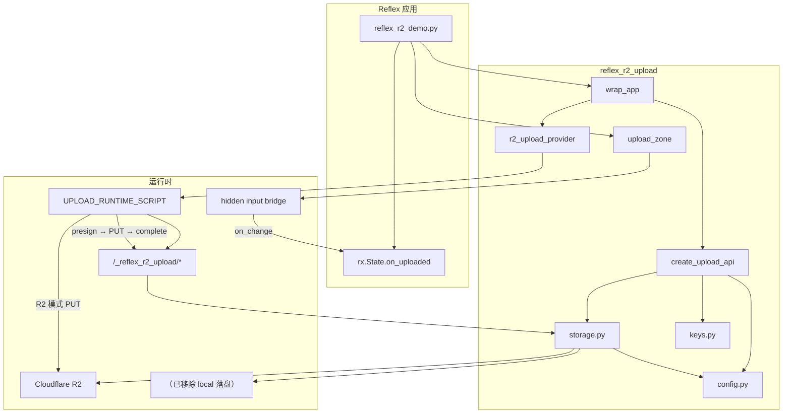
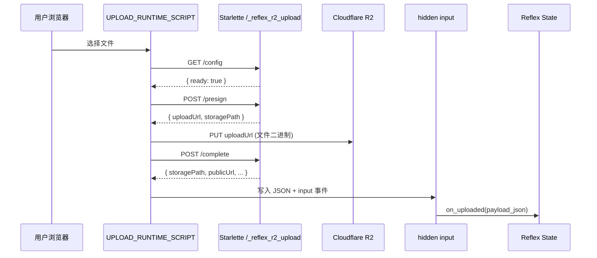

# reflex_r2_upload 框架原理与底层实现

**语言:** [中文](../README.md) · [English](../en/architecture.md)

| [文档首页](../README.md) | [配置](configuration.md) | [Bridge](bridge-payload.md) | [私有桶](private-bucket.md) | **架构** |

> 面向接入业务或二次开发的读者。含 Mermaid / ASCII 图，可用 [mermaid.live](https://mermaid.live) 渲染插图。

---

## 1. 概述

`reflex_r2_upload` 是一个为 [Reflex](https://reflex.dev) 框架设计的文件上传组件库。其核心能力是：

1. 在 Reflex 页面中渲染可复用的 **上传区域**（`upload_zone`）；
2. 通过 **presigned PUT** 让浏览器 **直传 Cloudflare R2**，避免大文件经过 Python 后端；
3. 上传完成后，通过 **隐藏 input 桥接** 将 JSON 结果回传给 Reflex State，触发 Python 侧业务逻辑。

设计参考了 [reflex-clerk-api](https://github.com/TimChild/reflex-clerk-api) 的 `wrap_app` 模式：一行代码完成全局 Provider 注册与后端路由挂载。

---

## 2. 设计目标与约束

| 目标 | 实现方式 |
|------|----------|
| 大文件高效上传 | 浏览器直传 R2，后端只签发 presigned URL |
| Reflex 原生集成 | Python 声明 UI + State；JS 负责文件 I/O |
| 开发体验友好 | `pytest -m r2` 集成测试验证 R2 链路，避免双模式歧义 |
| 依赖尽量轻 | API 层用 Starlette（Reflex 自带），不引入 FastAPI |
| 可嵌入任意 Reflex 应用 | `wrap_app(app)` 统一挂载，无需手写 `api_transformer` |

**当前 Demo 级限制**（生产接入前需自行补强）：

- 上传 API 无用户鉴权；
- `complete` 接口不校验 R2 上对象是否真实存在；
- `upload_zone` 的 `on_error` 参数已声明但未实现。

---

## 3. 整体架构

### 3.1 逻辑分层

```
┌─────────────────────────────────────────────────────────────────┐
│                        Reflex 应用层                             │
│  reflex_r2_demo.py  →  State.on_uploaded 处理上传结果            │
└────────────────────────────┬────────────────────────────────────┘
                             │ import
┌────────────────────────────▼────────────────────────────────────┐
│                     reflex_r2_upload 库                         │
├──────────────┬──────────────┬──────────────┬────────────────────┤
│  集成层      │  UI 层       │  API 层      │  存储层            │
│  wrap.py     │ upload_zone  │ routes.py    │ storage.py         │
│  provider.py │ provider.py  │ http.py      │ keys.py            │
│              │              │              │ config.py          │
└──────────────┴──────────────┴──────────────┴────────────────────┘
                             │
         ┌───────────────────┼───────────────────┐
         ▼                   ▼                   ▼
   Reflex 前端           Starlette 后端      Cloudflare R2
   (React + WS)          (端口 8000)         或本地磁盘
```

### 3.2 Mermaid 组件关系图



### 3.3 文件职责一览

| 文件 | 职责 |
|------|------|
| `__init__.py` | 导出 `wrap_app`、`upload_zone`、`public_url`、`create_upload_api` 等公开 API |
| `wrap.py` | 注册 `app_wraps`、链式合并 `api_transformer` |
| `provider.py` | 向每个页面注入一次 JS 运行时，设置 `data-backend-base`、`data-route-prefix` 等全局属性 |
| `upload_zone.py` | 上传区域 DOM 结构 + 完整浏览器端上传脚本 |
| `routes.py` | Starlette 保留路由：`/_reflex_r2_upload/{config,presign,complete}` |
| `storage.py` | R2 boto3 客户端、presigned URL、本地落盘、`public_url` |
| `keys.py` | `key_prefix` 规范化、文件名消毒、扩展名校验、重名避让 |
| `config.py` | 从环境变量读取后端模式、保留路由前缀、过期时间等 |
| `http.py` | `read_json`、`ok`、`fail`、`require_fields` 等薄封装 |

---

## 4. 应用集成：`wrap_app` 做了什么

用户只需在创建 `rx.App` 后调用：

```python
r2.wrap_app(app)
```

`wrap_app` 内部执行两件关键操作：

### 4.1 注册全局 Provider（前端）

```python
app.app_wraps[(1, "R2UploadProvider")] = lambda _: r2_upload_provider(...)
```

Reflex 的 `app_wraps` 机制会在 **每个页面根节点外** 包裹一层组件。`r2_upload_provider` 负责：

1. 注入 `<script>`，内容为 `UPLOAD_RUNTIME_SCRIPT`（只执行一次，`window.__reflexR2Upload` 防重复）；
2. 注入带 `data-backend-base`、`data-route-prefix` 的容器 div，供 JS 读取后端地址与保留路由前缀。

**注意**：单独使用 `upload_zone` 而不调用 `wrap_app`，页面上不会有上传脚本，上传区域将无法工作。

### 4.2 挂载 Starlette 保留路由（后端）

```python
app.api_transformer = _chain_api_transformer(app.api_transformer, upload_api)
```

Reflex 允许通过 `api_transformer` 将额外的 ASGI 应用挂到后端。本库创建 `create_upload_api()` 返回的 Starlette 应用，默认挂载到 **`/_reflex_r2_upload`**（下划线前缀，与 Reflex 官方的 `/_event`、`/_upload` 同属框架内部路由语义），并与已有的 transformer **链式合并**。

### 4.3 保留路由说明

与 [Reflex 官方 Reserved Routes](https://reflex.dev/docs/api-routes/overview/) 一致，下划线路径表示 **运行时内部管道，非业务 API**：

| Reflex 内置 | 本库 |
|-------------|------|
| `/_event` | `/_reflex_r2_upload/config` 等 |
| `/_upload`（`rx.upload()`） | 本库 R2 直传，**独立路径，不共用 `/_upload`** |

**请勿覆盖** `/_reflex_r2_upload/*`。若自定义 `REFLEX_R2_ROUTE_PREFIX`，须同步在 `wrap_app(route_prefix=...)` 中保持一致。

### 4.4 集成时序（ASCII）

```
开发者                    Reflex                    reflex_r2_upload
  │                         │                            │
  │── wrap_app(app) ───────>│                            │
  │                         │── 设置 app_wraps ─────────>│ provider 注册
  │                         │── 设置 api_transformer ───>│ Starlette 挂载
  │                         │                            │
  │── reflex run ──────────>│ 编译前端 + 启动后端         │
  │                         │                            │
  │<── 页面含 script + API ─│                            │
```

---

## 5. 前端实现：上传区域与 JS 桥接

### 5.1 `upload_zone` 的 DOM 结构

每个上传区域渲染为带 `data-r2-upload-zone` 的 `<div>`，内部包含：

```
┌──────────────────────────────────────────────┐
│  div#r2-zone-{hash}  [data-r2-upload-zone] │
│  ┌────────────────────────────────────────┐│
│  │ input#r2-zone-{hash}-bridge  (hidden)  ││  ← Reflex on_change 桥接
│  └────────────────────────────────────────┘│
│  📤 图标 + 提示文字                           │
│  ┌────────────────────────────────────────┐│
│  │ label > input[type=file]  (hidden)     ││  ← 用户选文件
│  └────────────────────────────────────────┘│
│  p[data-r2-status]  状态文字                 │
└──────────────────────────────────────────────┘
```

关键 `data-*` 属性：

| 属性 | 含义 |
|------|------|
| `data-key-prefix` | 对象存储路径前缀，如 `demo/uploads` |
| `data-bridge-id` | 隐藏 input 的 id，JS 写入回调 JSON |
| `data-content-type` | 默认 Content-Type |
| `data-allowed-extensions` | 逗号分隔的扩展名白名单 |

`zone_id` 由 `key_prefix` 的 SHA1 前 10 位生成，同一前缀的上传区共享逻辑 id，不同前缀互不干扰。

### 5.2 Reflex ↔ JavaScript 桥接原理

Reflex 的自定义组件若要在浏览器端执行逻辑并回传数据到 Python State，常见模式是：

1. 渲染一个 **隐藏的 `<input>`**，绑定 `on_change=State.handler`；
2. JS 在任务完成后，用原生方式设置 input.value 并 `dispatchEvent(new Event("input"))`；
3. Reflex 捕获 input 事件，将字符串参数传给 `@rx.event` 方法。

本库 `notifyBridge` 函数即实现此模式：

```
浏览器 JS                          DOM                         Reflex
    │                                │                            │
    │── JSON.stringify(payload) ────>│ hidden input.value = json  │
    │── dispatchEvent("input") ─────>│                            │
    │                                │── WebSocket / 事件 ────────>│ State.on_uploaded(payload_json)
```

成功时 payload 示例：

```json
{
  "error": false,
  "ok": true,
  "storagePath": "demo/uploads/model.glb",
  "originalFilename": "model.glb",
  "fileSizeBytes": 1048576,
  "contentType": "model/gltf-binary",
  "publicUrl": "https://cdn.example.com/demo/uploads/model.glb"
}
```

失败时：

```json
{
  "error": true,
  "message": "不允许的文件类型：evil.exe（允许：.glb）"
}
```

### 5.3 JS 运行时：事件监听

脚本在 `document` 上监听 `change` 事件（捕获阶段）：

1. 判断 `event.target` 是否为 `input[type=file]`；
2. 向上查找最近的 `[data-r2-upload-zone]`；
3. 调用 `handleZoneFiles` 执行上传流程；
4. 清空 file input，允许重复选择同一文件。

脚本通过 `window.__reflexR2Upload` 保证 **全页只初始化一次**，多个 `upload_zone` 共用同一套监听器。

### 5.4 后端地址解析（开发环境）

本地开发时前端（:3000）与后端（:8000）分离。`resolveBackendBase()` 按优先级：

1. 读取 `[data-backend-base]`（`wrap_app(backend_base=...)` 显式配置）；
2. 非 localhost 则返回 `""`（同源）；
3. 请求 `/env.json` 读取 Reflex 的 `PING` 字段推导后端 origin；
4. 回退到 `http://{hostname}:8000`。

---

## 6. 上传流程详解

### 6.1 流程总览



### 6.2 直传三步

**Step 1 — Presign** `POST /_reflex_r2_upload/presign`

请求体：

```json
{
  "keyPrefix": "demo/uploads",
  "filename": "model.glb",
  "contentType": "model/gltf-binary",
  "allowedExtensions": [".glb"]
}
```

服务端逻辑（`routes.py` → `keys.py` → `storage.py`）：

1. `allocate_storage_path`：规范化前缀、消毒文件名、校验扩展名、若 key 已存在则追加 `_2`、`_3`…
2. `create_presigned_put_url`：boto3 生成 PUT presigned URL（默认 600 秒有效）

响应：

```json
{
  "uploadUrl": "https://...r2.cloudflarestorage.com/...",
  "storagePath": "demo/uploads/model.glb",
  "contentType": "model/gltf-binary"
}
```

**Step 2 — 浏览器 PUT**

JS 直接 `fetch(uploadUrl, { method: "PUT", body: file })`，**不经过 Python**。  
R2 桶必须配置 CORS，允许本站 origin 的 `PUT` 请求，否则浏览器报 `failed to fetch`。

**Step 3 — Complete** `POST /_reflex_r2_upload/complete`

请求体：

```json
{
  "keyPrefix": "demo/uploads",
  "storagePath": "demo/uploads/model.glb",
  "originalFilename": "model.glb",
  "fileSizeBytes": 1048576,
  "contentType": "model/gltf-binary"
}
```

服务端 `validate_storage_path` 确保 `storagePath` 以 `keyPrefix/` 开头，然后返回带 `publicUrl` 的结果。**当前不调用 `head_object` 验证文件是否真实上传。**

### 6.3 配置检查与测试

`GET /config` 返回 `ready` 与 `missingEnv`，供前端在上传前提示缺少的 R2 变量。

本地开发请配置 `.env` 后运行：

```bash
pytest tests/test_r2_integration.py -m r2
```

验证完整 presign → PUT → complete 链路，避免维护一套行为不同的 local 模式。

---

## 7. 存储层实现

### 7.1 R2 客户端

`storage.py` 使用 boto3 S3 兼容接口连接 R2：

```
endpoint: https://{R2_ACCOUNT_ID}.r2.cloudflarestorage.com
region:   auto
签名:     s3v4
```

客户端通过 `@lru_cache` 单例化，避免重复建连。

### 7.2 公开 URL 生成

`public_url(storage_path)` 逻辑：

1. 若已是 `http(s)://` 开头，原样返回；
2. R2 模式且配置了 `R2_PUBLIC_BASE_URL`：`{base}/{url_encoded_path}`；
3. 未配置 `R2_PUBLIC_BASE_URL` 时返回原始 `storage_path`。

路径分段 URL 编码，支持中文文件名。

### 7.3 对象 key 安全策略（`keys.py`）

```
用户输入 key_prefix="demo/uploads"
用户文件名 "../../../etc/passwd"
        │
        ▼
normalize_prefix()  → 去首尾斜杠、拒绝 ".."
safe_filename()     → 只保留 basename，替换非法字符
is_allowed_extension() → 校验后缀白名单
unique_storage_key()   → HEAD/本地检查，冲突则 model_2.glb
        │
        ▼
最终 key: "demo/uploads/passwd"  （而非越权路径）
```

---

## 8. 后端保留路由参考

默认前缀：`/_reflex_r2_upload`（可通过 `REFLEX_R2_ROUTE_PREFIX` 修改；旧名 `REFLEX_R2_API_PREFIX` 仍兼容）

完整路径示例：

| 方法 | 路径 | 作用 |
|------|------|------|
| GET | `/_reflex_r2_upload/config` | 返回 `ready`、`missingEnv`、`publicBaseUrl`、`routePrefix` |
| POST | `/_reflex_r2_upload/presign` | 签发 presigned PUT URL |
| POST | `/_reflex_r2_upload/complete` | 校验路径前缀，返回最终元数据 |

错误响应统一为 `{ "detail": "错误信息" }`，HTTP 400（或 500）。

> **注意**：这些路由供上传组件内部调用。请勿在 `api_transformer` 中注册冲突路径；业务 API 建议使用 `/api/...` 等独立前缀。

---

## 9. 配置项完整说明

| 环境变量 | 默认值 | 说明 |
|----------|--------|------|
| `R2_ACCOUNT_ID` | — | **必填** Cloudflare 账号 ID |
| `R2_ACCESS_KEY_ID` | — | **必填** R2 API 令牌 Access Key |
| `R2_SECRET_ACCESS_KEY` | — | **必填** R2 API 令牌 Secret |
| `R2_BUCKET_NAME` | — | **必填** 桶名 |
| `R2_PUBLIC_BASE_URL` | — | 自定义域名或 R2 公开访问域名 |
| `REFLEX_R2_ROUTE_PREFIX` | `/_reflex_r2_upload` | 保留路由前缀（勿与业务 `/api` 混用） |
| `REFLEX_R2_PRESIGN_EXPIRES` | `600` | presigned URL 有效期（秒），最小 60 |

---

## 10. 数据流全景（可复制到 Word 的 ASCII 图）

```
┌──────────┐    选文件     ┌─────────────────┐
│   用户   │──────────────>│  file input     │
└──────────┘               └────────┬────────┘
                                    │ change 事件
                                    ▼
                           ┌─────────────────┐
                           │ UPLOAD_RUNTIME  │
                           │    _SCRIPT      │
                           └────────┬────────┘
                                    │
                    ┌───────────────┴───────────────┐
                    │ GET /config (ready?)          │
                    ▼                               │
              ┌─────────┐                             │
              │/presign │ POST                        │
              └────┬────┘                             │
                   │ PUT 文件                          │
                   ▼                                  │
              ┌─────────┐                             │
              │   R2    │                             │
              └────┬────┘                             │
                   │ POST /complete                   │
                   ▼                                  │
        ┌─────────────────────────┐                    │
        │  JSON 结果               │                    │
        └────────────┬────────────┘                    │
                     │ notifyBridge                     │
                     ▼                                  │
              ┌─────────────┐                          │
              │ hidden input │──on_change──> Reflex State│
              └─────────────┘                          │
```

---

## 11. 高级用法：不经过 `wrap_app`

若需更细粒度控制，可手动组合：

```python
import reflex as rx
from reflex_r2_upload import create_upload_api, r2_upload_provider

upload_api = create_upload_api(prefix="/_reflex_r2_upload")

app = rx.App(
    api_transformer=upload_api,
    app_wraps={
        (1, "R2Upload"): lambda c: r2_upload_provider(
            c, backend_base="", route_prefix="/_reflex_r2_upload"
        ),
    },
)
```

`wrap_app` 本质上就是上述逻辑的便捷封装，并处理了 `api_transformer` 链式合并。

---

## 12. 生产环境加固建议

以下为当前实现的已知缺口及推荐补强方向：

| 风险 | 现状 | 建议 |
|------|------|------|
| 未授权上传 | 任何人可调用 presign | 在 presign 前校验 Reflex 会话 / JWT，并将 `key_prefix` 绑定到用户 ID |
| 伪造 complete | 不验证 R2 对象存在 | complete 时 `head_object`，校验 Content-Length |
| 密钥泄露 | `.env` 含 R2 凭证 | 密钥仅存服务端；`.env` 加入 `.gitignore` |
| CORS 错误 | R2 桶未配 CORS | 在 Cloudflare 控制台为桶添加 PUT 允许的 Origin |
| 重名竞态 | presign 与 PUT 之间可能被抢占 | 生产可用 UUID 中间段，或在 complete 时做最终一致性检查 |

---

## 13. 与 Reflex 生态的关系

```
┌────────────────────────────────────────────────────┐
│                    Reflex 框架                      │
│  ┌──────────────┐  ┌──────────────┐  ┌──────────┐ │
│  │ rx.Component │  │  rx.State    │  │ api_     │ │
│  │ 页面声明      │  │ 事件处理      │  │transformer│ │
│  └──────┬───────┘  └──────▲───────┘  └────▲─────┘ │
│         │                  │               │       │
│  ┌──────▼──────────────────┴───────────────┴─────┐ │
│  │           reflex_r2_upload（本库）              │ │
│  │  upload_zone + JS bridge + Starlette routes  │ │
│  └──────────────────────────────────────────────┘ │
└────────────────────────────────────────────────────┘
```

本库 **不修改 Reflex 源码**，完全通过公开扩展点（`app_wraps`、`api_transformer`、自定义 `rx.el` 组件）实现，因此可随 Reflex 版本升级独立维护。

---

## 14. 附录：Demo 应用走读

`reflex_r2_demo/reflex_r2_demo.py` 是最小完整示例：

1. `load_dotenv()` 加载根目录 `.env`；
2. `State.on_uploaded` 解析 bridge 传来的 JSON，更新 `message` / `last_path`；
3. 页面渲染 `r2.upload_zone(...)`，限制 `.glb` 扩展名；
4. `r2.wrap_app(app)` 完成集成；
5. `rxconfig.py` 中 `app_name="reflex_r2_demo"` 决定 Reflex 编译输出目录。

运行 `reflex run` 后，前端 :3000、后端 :8000，保留路由挂载在后端 `/_reflex_r2_upload/*`。

---

## 15. 术语表

| 术语 | 含义 |
|------|------|
| presigned URL | 带签名、限时有效的 URL，允许持有者执行特定 S3/R2 操作（此处为 PUT） |
| key_prefix | 对象存储中的逻辑目录前缀，如 `users/42/avatar` |
| storage_path | 对象在桶或本地目录中的完整相对路径 |
| bridge | 隐藏 input 元素，用于 JS 向 Reflex State 传递字符串 |
| app_wraps | Reflex 提供的全局页面包裹机制 |
| api_transformer | Reflex 提供的后端 ASGI 应用挂载钩子 |
| 保留路由 | 下划线前缀的后端路径（如 `/_reflex_r2_upload`），框架内部使用，勿覆盖 |

---

| [← 私有桶](private-bucket.md) | [文档首页](../README.md) | [English](../en/architecture.md) |

*文档版本：与仓库同步，库版本见 `reflex_r2_upload.__version__`。*
